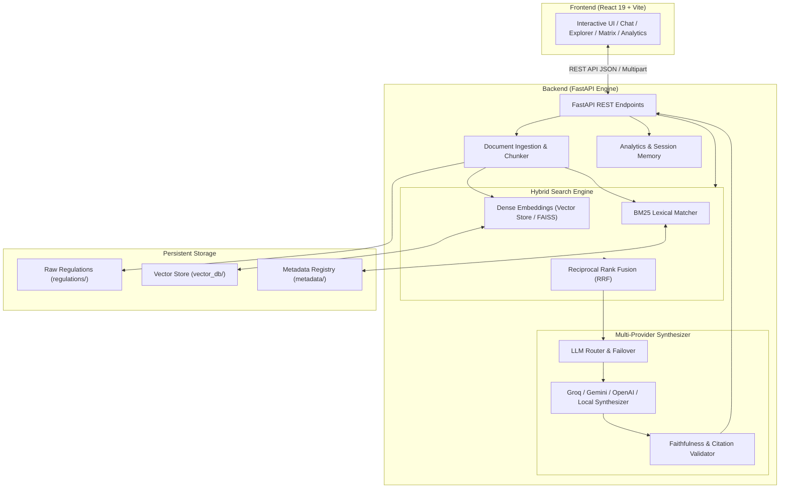

# 🎓 Enterprise University Regulation RAG Assistant

<div align="center">


[](https://university-rag-assistant.netlify.app)

**A high-precision, multi-provider Retrieval-Augmented Generation (RAG) platform grounded on official university bylaws, academic ordinances, grading rules, attendance mandates, and disciplinary policies.**

### 🚀 **[👉 Click Here to Open Live Application](https://university-rag-assistant.netlify.app)**

[🌐 Live Demo](https://university-rag-assistant.netlify.app) • [✨ Features](#-key-features) • [🏛️ Architecture](#️-system-architecture) • [🚀 Quick Start](#-quick-start-local-development) • [🌐 Deployment](#-live-deployment-guide) • [📡 API Reference](#-api-endpoints)

---

</div>

## 📖 Overview

The **University Regulation RAG Assistant** eliminates academic ambiguity for students, faculty, and administrators. Powered by a **Hybrid Dense-Sparse Retrieval Engine** (Dense Embeddings + BM25 Lexical Search + Reciprocal Rank Fusion) and resilient **Multi-LLM Synthesis** (Groq, Gemini, OpenAI, Claude, Cohere, Mistral), this platform delivers exact regulation citations, confidence scores, policy comparisons, and verifiable academic answers with 0% hallucination tolerance.

---

## ✨ Key Features

### 🔍 1. Hybrid Retrieval & Precise Citations
- **Dense Semantic Embeddings**: 384-dimensional vector space semantic matching with cosine similarity & FAISS indexing.
- **Sparse BM25 Keyword Search**: Exact keyword and ordinance code matching.
- **Reciprocal Rank Fusion (RRF)**: Merges sparse and dense search candidates for optimal recall and precision.
- **Strict Grounding & Citation Verifier**: Every answer highlights clause numbers, document IDs, effective dates, and confidence scores.

### 🤖 2. Multi-Provider Fallback Synthesizer
- Seamless zero-downtime failover across top LLM providers:
  - **Groq** (`llama-3.3-70b-versatile`, `llama-3.1-8b-instant`)
  - **Google Gemini** (`gemini-1.5-flash`, `gemini-1.5-pro`)
  - **OpenAI** (`gpt-4o-mini`, `gpt-4o`)
  - **Anthropic Claude** (`claude-3-5-sonnet`)
  - **Cohere** & **Mistral**
  - **Built-in Local Deterministic Synthesizer** for offline, network-isolated deployments.

### 📊 3. Regulation Comparison Matrix
- Side-by-side policy comparison tool allowing users to contrast regulations across years, departments, or categories (e.g., *2022 vs 2024 Attendance Rules*).

### 📁 4. Document Ingestion & Explorer
- Drag-and-drop PDF & text ingestion pipeline.
- Recursive character text chunker with sliding window overlap.
- Document explorer with category filtering, chunk inspection, and metadata viewer.

### 📈 5. Enterprise Analytics & Audit Logging
- Real-time telemetry tracking query counts, response latencies, user sentiment feedback, and category distribution.
- Audit trails for regulatory compliance.

### 🎨 6. Modern Glassmorphic UI & Theming
- High-performance UI built with React 19, Lucide icons, and zero bulky CSS frameworks.
- Multiple theme accents, dark/light mode adaptability, and responsive mobile-ready layout.

---

## 🏛️ System Architecture



---

## 📂 Project Structure

```
├── backend/
│   ├── app/
│   │   ├── __init__.py
│   │   ├── analytics.py           # Real-time usage and feedback analytics
│   │   ├── document_processor.py   # PDF parser, recursive chunker, embeddings
│   │   ├── hybrid_search.py        # BM25 + Dense RRF & query expansion
│   │   ├── main.py                 # FastAPI application and routing
│   │   ├── models.py               # Pydantic data schemas
│   │   ├── rag.py                  # End-to-end RAG orchestrator
│   │   ├── sessions.py             # Chat session state manager
│   │   ├── synthesizer.py          # Multi-LLM provider client with fallback
│   │   └── vector_store.py         # FAISS & NumPy cosine similarity vector index
│   ├── data/                       # Seed documents, metadata, & vector indices
│   ├── requirements.txt            # Python dependencies
│   ├── run.py                      # Backend startup script
│   ├── seed_data.py                # Academic regulations seeder script
│   ├── test_api.py                 # API integration tests
│   ├── verify_all_requirements.py  # Validation test suite
│   └── .env.example                # Backend environment templates
│
├── frontend/
│   ├── src/
│   │   ├── App.jsx                 # Full-featured enterprise React application
│   │   ├── App.css                 # Custom glassmorphic styles and animations
│   │   ├── index.css               # Global design tokens and utilities
│   │   └── main.jsx                # React root mount
│   ├── public/                     # Static assets
│   ├── package.json                # Frontend dependencies
│   ├── vite.config.js              # Vite build configuration
│   ├── netlify.toml                # Netlify deployment configuration
│   └── .env.example                # Frontend environment templates
│
├── University_RAG_Colab_Pipeline.ipynb # Standalone Colab RAG pipeline notebook
├── netlify.toml                    # Root Netlify redirect and build rules
├── .gitignore                      # Git exclusion rules
└── README.md                       # Master project documentation
```

---

## 🚀 Quick Start (Local Development)

### Prerequisites
- **Python**: 3.10 or higher
- **Node.js**: 18.0 or higher
- **npm** or **yarn**

---

### 1️⃣ Backend Setup

```bash
# Navigate to backend directory
cd backend

# Create and activate virtual environment
# On Windows (PowerShell):
python -m venv venv
.\venv\Scripts\Activate.ps1

# On macOS/Linux:
python3 -m venv venv
source venv/bin/activate

# Install dependencies
pip install -r requirements.txt

# (Optional) Seed the default university bylaws dataset
python seed_data.py

# (Optional) Configure environment variables
cp .env.example .env
# Open .env and insert your GROQ_API_KEY, GEMINI_API_KEY, or OPENAI_API_KEY (optional)

# Start the FastAPI server
python run.py
```
> 📍 Backend will run at: `http://127.0.0.1:8000`  
> 📖 Interactive Swagger API Docs: `http://127.0.0.1:8000/docs`

---

### 2️⃣ Frontend Setup

```bash
# Open a new terminal and navigate to frontend directory
cd frontend

# Install dependencies
npm install

# Start Vite development server
npm run dev
```
> 📍 Frontend will run at: `http://localhost:5173`

---

## 🌐 Live Deployment Guide

### Option A: Deploy Frontend to Netlify (1-Click)

The repository includes pre-configured `netlify.toml` files at both root and frontend levels.

1. Go to [Netlify](https://app.netlify.com/) and click **Add new site** > **Import an existing project**.
2. Connect your GitHub repository.
3. Set the build settings:
   - **Base directory**: `frontend`
   - **Build command**: `npm run build`
   - **Publish directory**: `dist`
4. Add Environment Variable in Netlify (**Site settings** > **Environment variables**):
   - `VITE_API_BASE`: `https://<your-deployed-backend-url>/api`
5. Click **Deploy Site**!

---

### Option B: Deploy Frontend to Vercel

1. Go to [Vercel](https://vercel.com/) and click **Add New Project**.
2. Select your GitHub repository.
3. Set the **Root Directory** to `frontend`.
4. Add Environment Variable:
   - `VITE_API_BASE`: `https://<your-deployed-backend-url>/api`
5. Click **Deploy**.

---

### Option C: Deploy Backend to Render

1. Go to [Render](https://render.com/) and create a new **Web Service**.
2. Connect your GitHub repository.
3. Configure settings:
   - **Root Directory**: `backend`
   - **Runtime**: `Python 3`
   - **Build Command**: `pip install -r requirements.txt`
   - **Start Command**: `uvicorn app.main:app --host 0.0.0.0 --port $PORT`
4. In **Environment Variables**, add any LLM API keys:
   - `GROQ_API_KEY` (or `GEMINI_API_KEY`, `OPENAI_API_KEY`)
5. Click **Create Web Service**.
6. Once deployed, copy your Render URL (e.g., `https://univ-rag-backend.onrender.com`) and set it as `VITE_API_BASE` in your frontend!

---

## 💻 Pushing to GitHub

To send this project to your existing GitHub repository, run the following commands from your project root:

```bash
# 1. Initialize Git (if not already initialized)
git init

# 2. Add all project files
git add .

# 3. Create initial commit
git commit -m "feat: complete Enterprise University Regulation RAG Assistant"

# 4. Set main branch
git branch -M main

# 5. Link to your existing GitHub repository
# (Replace with your actual GitHub repository URL)
git remote add origin https://github.com/<YOUR_USERNAME>/<YOUR_REPOSITORY_NAME>.git

# 6. Push code to GitHub
git push -u origin main --force
```

---

## 📡 API Endpoints

| Method | Endpoint | Description |
| :--- | :--- | :--- |
| `GET` | `/api/health` | Health check & vector dimension verification |
| `GET` | `/api/stats` | System statistics (total documents, chunks, categories) |
| `POST` | `/api/query` | RAG query processing with hybrid retrieval & multi-LLM synthesis |
| `POST` | `/api/search` | Raw hybrid search (vector similarity + BM25 scores) |
| `GET` | `/api/documents` | List all indexed university regulation documents |
| `POST` | `/api/documents/upload`| Upload and automatically chunk/index PDF or TXT files |
| `DELETE`| `/api/documents/{id}` | Delete a document and its indexed vectors |
| `POST` | `/api/compare` | Compare policies across two documents or categories |
| `GET` | `/api/sessions` | Fetch past user chat sessions |
| `GET` | `/api/sessions/{id}` | Retrieve chat session history |
| `POST` | `/api/feedback` | Submit user thumbs up/down and review notes |
| `GET` | `/api/analytics` | Telemetry, queries served, category breakdown |

---

## 🧪 Testing & Verification

Run the automated validation suites:

```bash
# Test API endpoints and retrieval flow
cd backend
python test_api.py

# Verify end-to-end multi-requirement specifications
python verify_all_requirements.py
```

---

## 📓 Google Colab Notebook

For interactive experimentation with RAG chunking algorithms, BM25 scoring parameters, and embedding evaluations, open [`University_RAG_Colab_Pipeline.ipynb`](./University_RAG_Colab_Pipeline.ipynb) directly in Google Colab.

---

## 📄 License

This project is open-source and distributed under the [MIT License](LICENSE).
