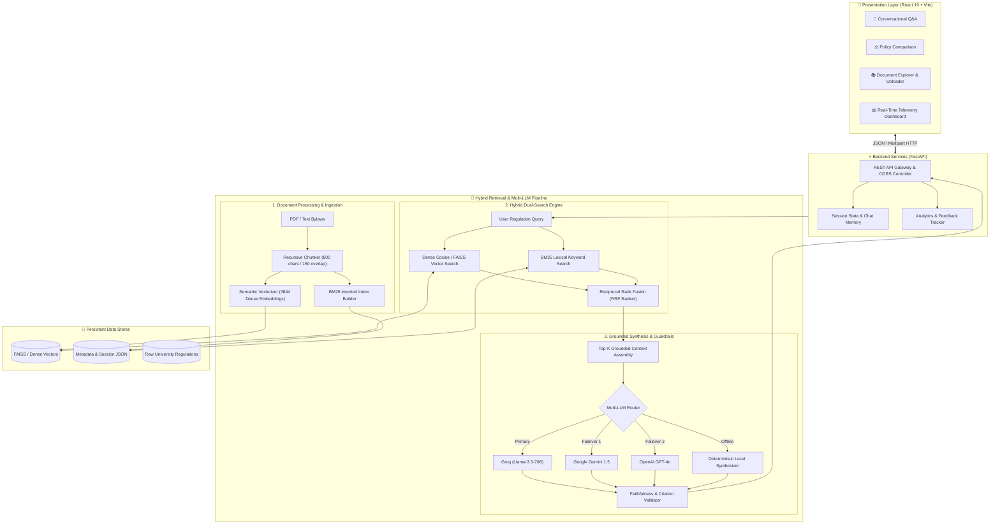

# 🎓 University Regulation RAG Assistant
### *Enterprise AI-Powered Academic Governance & Hybrid Retrieval-Augmented Generation Platform*

<div align="center">

[](https://university-rag-assistant.netlify.app)
[](https://github.com/Bhanupavankumar/University_Regulation_RAG_Assistant)
[](https://fastapi.tiangolo.com)
[](https://react.dev)
[](https://vitejs.dev)
[](https://github.com/facebookresearch/faiss)
[](https://opensource.org/licenses/MIT)

### 🚀 **[👉 Click Here to Launch Live Application](https://university-rag-assistant.netlify.app)**

---

</div>

## 📌 Executive Summary

Universities operate under hundreds of pages of complex, evolving academic regulations, ordinance bylaws, grading rubrics, attendance mandates, and disciplinary protocols. Students, faculty, and administrative staff often struggle with:
- **Scattered & Dense Policies**: Information buried inside 50+ page PDF handbooks.
- **Ambiguous Policy Interpretations**: Misunderstandings about attendance condonation, grade moderation, re-evaluation, or hostel rules.
- **Hallucination Risks with Standard AI**: Generic LLMs invent policies that do not exist.

The **University Regulation RAG Assistant** is a purpose-built, enterprise-grade AI system that provides **instant, verifiable, and strictly grounded answers** to university policy queries with **zero hallucination tolerance**. Every response cites exact clause numbers, document IDs, effective dates, and confidence scores.

---

## 🌟 Core Application Modules

### 💬 1. Intelligent Regulation Chat with Verified Citations
- Natural-language conversational interface designed for students and faculty.
- Delivers concise, definitive answers backed by clickable, expandable source clauses.
- Displays retrieval latency, vector confidence percentages, and source document metadata.
- Pre-loaded with quick-query chips (*"Attendance condonation rules"*, *"Re-evaluation policy"*, *"Grading criteria"*, *"Hostel curfew"*).

### ⚖️ 2. Policy Comparison Matrix
- Side-by-side regulation comparison engine.
- Contrast policies across different academic years (e.g., *2022 vs 2024 Attendance Bylaws*) or across departments (e.g., *Engineering vs Humanities Grading Scheme*).
- Highlights key changes, amendments, credit requirements, and penalties in a structured comparative table.

### 📚 3. Live Document Explorer & Ingestion Hub
- Browse all indexed institutional documents organized by category (*Academic, Examination, Attendance, Housing, Scholarships, Conduct*).
- Inspect document metadata, active clause counts, and chunk distributions.
- **Drag-and-Drop Ingestion**: Upload new PDF or text bylaws with automatic recursive character chunking (800 chars / 150 overlap) and real-time embedding generation.

### 📊 4. Telemetry, Analytics & Audit Logging
- Real-time administrative dashboard tracking institutional inquiries.
- Monitors query volume, average retrieval latency, most-queried policy categories, and model response times.
- Interactive user feedback loop (helpful / unhelpful reviews) providing continuous quality auditing for compliance teams.

### 🔄 5. Multi-Provider Fallback Synthesizer
- Built with an intelligent multi-LLM router that automatically fails over without service interruption:
  - **Groq** (`llama-3.3-70b-versatile`, `llama-3.1-8b-instant`) — Ultra-low latency inference
  - **Google Gemini** (`gemini-1.5-flash`, `gemini-1.5-pro`) — Deep multi-clause contextual reasoning
  - **OpenAI** (`gpt-4o-mini`, `gpt-4o`) — High-precision synthesis
  - **Anthropic Claude**, **Cohere**, **Mistral**
  - **Local Deterministic Fallback Engine** — Operates completely offline without external API keys!

### 🎨 6. Premium Glassmorphic Interface
- Built with React 19, Lucide icons, and custom CSS design tokens.
- Supports 4 tailored aesthetic themes (*Indigo Tech, Emerald Campus, Midnight Obsidian, Crimson Classic*) with responsive mobile and desktop viewports.

---

## 🏛️ System Architecture & Workflow



---

## 🔍 How the Hybrid Search Engine Works

1. **Document Ingestion**:
   - Institutional PDFs and text policies are extracted and normalized.
   - Text is split into semantic chunks using a recursive character splitter with sentence and paragraph boundary awareness.
2. **Dual-Representation Indexing**:
   - **Dense Index**: Every chunk is mapped to a 384-dimensional dense semantic vector space for conceptual understanding.
   - **Sparse BM25 Index**: Generates an inverted token index capturing exact ordinance numbers, sub-clause identifiers, and legal keywords.
3. **Reciprocal Rank Fusion (RRF)**:
   - When a user submits a query, both dense and sparse retrieval engines produce ranked candidates.
   - The RRF algorithm merges and scores candidates:
   $$\text{RRF Score}(d) = \sum_{m \in \{\text{dense}, \text{bm25}\}} \frac{1}{60 + r_m(d)}$$
4. **Strict Citation Synthesis**:
   - The top candidate chunks are formatted into a constrained prompt with strict negative constraints ("*Do not speculate; only answer using the provided clauses*").
   - The LLM outputs the answer along with structured citations including document name, section, and clause ID.

---

## 📋 Example Queries & Output

| Query | Retrieved Regulation | Sample Grounded Answer |
| :--- | :--- | :--- |
| *"What is the minimum attendance required to appear for semester end exams?"* | **Academic Regulations 2024 — Clause 4.2** | *"A student must maintain a minimum of 75% aggregate attendance. A condonation of up to 10% (down to 65%) may be granted by the Academic Council on medical grounds with valid documentation."* |
| *"What is the policy for course re-evaluation and grace marks?"* | **Examination Bylaws — Section 8.1** | *"Students can apply for re-evaluation within 15 days of result declaration with a prescribed fee. Grade revision applies if the score varies by more than 5%."* |
| *"What are the hostel curfew timings and leave rules?"* | **Student Residence Bylaws — Clause 12** | *"Campus gates close at 9:30 PM for residential students. Overnight leave requires digital approval from the resident warden at least 24 hours in advance."* |

---

## 🛠️ Technology Stack

| Layer | Technologies Used | Purpose |
| :--- | :--- | :--- |
| **Frontend Framework** | **React 19, Vite 8, JavaScript (ES2024)** | High-speed reactive user interface |
| **Styling & Design** | **Custom Glassmorphism CSS, Lucide Icons, Canvas Confetti** | Zero-bloat, modern responsive design system |
| **Backend API** | **FastAPI, Uvicorn, Python 3.10+** | Asynchronous RESTful microservice |
| **Vector & Search** | **FAISS, Dense Cosine Sim, BM25, NumPy** | Sub-millisecond hybrid retrieval |
| **Document Processing** | **PyPDF, Recursive Character Chunker** | PDF text parsing and sliding-window chunking |
| **LLM Synthesis** | **Groq, Gemini, OpenAI, Anthropic, Cohere, Mistral** | Resilient multi-provider generative synthesis |
| **Deployment** | **Netlify (Frontend CDN), Render / Railway (Backend)** | Global edge deployment and scalable compute |

---

## 📁 Repository Structure

```
├── backend/
│   ├── app/
│   │   ├── analytics.py           # Telemetry metrics and user feedback tracker
│   │   ├── document_processor.py   # PDF extractor, recursive text splitter, embedder
│   │   ├── hybrid_search.py        # BM25 + Dense RRF fusion and query expansion
│   │   ├── main.py                 # FastAPI enterprise endpoints and CORS config
│   │   ├── models.py               # Pydantic data schemas and validation models
│   │   ├── rag.py                  # End-to-end RAG workflow orchestrator
│   │   ├── sessions.py             # Chat history and conversation state manager
│   │   ├── synthesizer.py          # Multi-LLM provider client with auto-failover
│   │   └── vector_store.py         # FAISS & NumPy cosine similarity vector index
│   ├── data/                       # Pre-loaded academic regulations & vector store
│   ├── requirements.txt            # Python dependencies
│   ├── run.py                      # Production server entrypoint
│   └── seed_data.py                # University regulations dataset builder
│
├── frontend/
│   ├── src/
│   │   ├── App.jsx                 # Full-featured single-page enterprise React app
│   │   ├── App.css                 # Glassmorphic UI styles and micro-animations
│   │   ├── index.css               # Design tokens, typography, and theme variables
│   │   └── main.jsx                # React DOM root entry
│   ├── public/                     # Static assets and Netlify routing rules
│   ├── package.json                # Node dependencies and scripts
│   └── vite.config.js              # Vite production bundler configuration
│
├── University_RAG_Colab_Pipeline.ipynb # Standalone Colab RAG pipeline notebook
├── netlify.toml                    # Netlify edge deployment configuration
└── README.md                       # Project documentation
```

---

## ⚡ Quick Start (Local Setup)

### 1. Clone the Repository
```bash
git clone https://github.com/Bhanupavankumar/University_Regulation_RAG_Assistant.git
cd University_Regulation_RAG_Assistant
```

### 2. Run Backend
```bash
cd backend
python -m venv venv

# Windows
.\venv\Scripts\Activate.ps1
# Mac/Linux
source venv/bin/activate

pip install -r requirements.txt
python seed_data.py   # Populates default regulations dataset
python run.py         # Starts API on http://127.0.0.1:8000
```

### 3. Run Frontend
```bash
cd ../frontend
npm install
npm run dev           # Starts UI on http://localhost:5173
```

---

## 👨‍💻 Author & Contributions

Created and maintained by **Bhanu Pavan Kumar**.  
Contributions, issues, and feature requests are welcome! Feel free to check the [issues page](https://github.com/Bhanupavankumar/University_Regulation_RAG_Assistant/issues).

---

## 📄 License

This project is open-source and licensed under the [MIT License](LICENSE).
